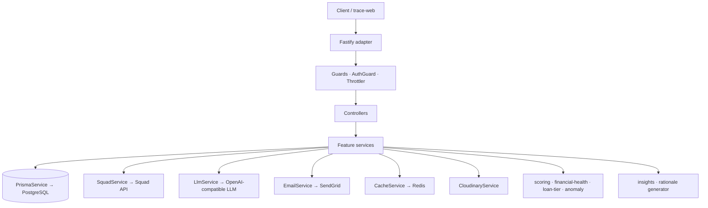

<!-- markdownlint-disable MD028 MD060 -->

# TRACE BACKEND

This document defines **how developers should work on this application**. It covers the **tools**, **rules**, and **development flow** to ensure consistency, quality, and scalability. Please read and understand thoroughly before starting any work.

Trace is a Nigerian financial copilot — it ingests a user's bank activity, scores their financial health, recommends loans/investments/opportunities, and answers questions in natural language via an AI copilot. This repository is the backend API that powers all of that.

---

## Purpose

- Maintain a clean, scalable, and maintainable codebase
- Ensure consistency across modules and contributors
- Reduce bugs and onboarding time
- Enforce best practices for NestJS + Prisma + Fastify
- Ensure DRY code — extract a helper the moment a pattern is reused
- Stick to KISS — prefer the boring, obvious solution over clever abstractions
- Handle **money** with the discipline it deserves: integer kobo, atomic transactions, no rounding surprises

---

> [!IMPORTANT]
> Not following these rules will block your PR from being merged. Thanks.

> [!CAUTION]
> All monetary amounts in the database and across the wire are **integers in kobo** (1 NGN = 100 kobo). Never store or transmit naira floats. Conversion happens only at the UI boundary.

## Table of content

- [How to contribute](#how-to-contribute)
- [Tools & Libraries](#tools--libraries)
- [Architecture](#architecture)
- [Workflow](#workflow)
- [Project Infrastructure](#project-infrastructure)
- [Money, Currency & Financial Rules](#money-currency--financial-rules)
- [Database & Migrations](#database--migrations)
- [Environment Configuration](#environment-configuration)
- [How to run the app](#how-to-run)

### How to contribute

- Clone the project from the GitHub repo
- Create your own working branch from the latest `main`
- After completing your work, push and open a pull request to `main` — it will be reviewed and merged if it meets our standards

### Tools & Libraries

| #   | Package Name                    | Purpose                                                                | Documentation                                                                                                |
| :-- | :------------------------------ | :--------------------------------------------------------------------- | :----------------------------------------------------------------------------------------------------------- |
| 01  | NestJS                          | Application framework — controllers, providers, modules, DI            | [https://docs.nestjs.com](https://docs.nestjs.com)                                                            |
| 02  | Fastify                         | HTTP adapter — faster alternative to Express under Nest                | [https://fastify.dev](https://fastify.dev)                                                                    |
| 03  | Prisma                          | ORM and migration tool against PostgreSQL                              | [https://www.prisma.io/docs](https://www.prisma.io/docs)                                                      |
| 04  | PostgreSQL                      | Primary datastore                                                      | [https://www.postgresql.org/docs](https://www.postgresql.org/docs)                                            |
| 05  | Redis (via Keyv)                | Cache layer + ephemeral state                                          | [https://keyv.org](https://keyv.org)                                                                          |
| 06  | Joi                             | Environment variable validation — blocks startup if env is misconfigured | [https://joi.dev](https://joi.dev)                                                                          |
| 07  | class-validator                 | DTO field validation (`@IsString`, `@IsEmail`, etc.)                   | [https://github.com/typestack/class-validator](https://github.com/typestack/class-validator)                  |
| 08  | class-transformer               | Plain-object ↔ class instance transformation for DTOs                  | [https://github.com/typestack/class-transformer](https://github.com/typestack/class-transformer)              |
| 09  | @nestjs/swagger                 | OpenAPI/Swagger doc generation from decorators                         | [https://docs.nestjs.com/openapi/introduction](https://docs.nestjs.com/openapi/introduction)                  |
| 10  | @nestjs/throttler               | Rate limiting                                                          | [https://docs.nestjs.com/security/rate-limiting](https://docs.nestjs.com/security/rate-limiting)              |
| 11  | Argon2                          | Password hashing (Argon2id)                                            | [https://github.com/ranisalt/node-argon2](https://github.com/ranisalt/node-argon2)                            |
| 12  | jose                            | JWT signing/verification (access tokens, OAuth ID-token validation)    | [https://github.com/panva/jose](https://github.com/panva/jose)                                                |
| 13  | SendGrid                        | Transactional email                                                    | [https://docs.sendgrid.com](https://docs.sendgrid.com)                                                        |
| 14  | Cloudinary                      | Document/image uploads (KYC, opportunity attachments)                  | [https://cloudinary.com/documentation](https://cloudinary.com/documentation)                                  |
| 15  | Squad                           | Nigerian payments — virtual accounts, bank transfers, name lookup      | [https://docs.squadco.com](https://docs.squadco.com)                                                          |
| 16  | LLM module (OpenAI-compatible)  | Insights narratives, copilot responses — any OpenAI-compatible provider | [https://platform.openai.com/docs](https://platform.openai.com/docs)                                         |
| 17  | date-fns                        | Date arithmetic and formatting                                         | [https://date-fns.org](https://date-fns.org)                                                                  |
| 18  | handlebars                      | Email templating                                                       | [https://handlebarsjs.com](https://handlebarsjs.com)                                                          |
| 19  | Jest                            | Unit + e2e testing                                                     | [https://jestjs.io](https://jestjs.io)                                                                        |
| 20  | ESLint + Prettier               | Linting + formatting                                                   | [https://eslint.org](https://eslint.org) · [https://prettier.io](https://prettier.io)                         |
| 21  | pnpm                            | Package manager — `pnpm-lock.yaml` is the source of truth              | [https://pnpm.io](https://pnpm.io)                                                                            |
| 22  | Docker Compose                  | Local Postgres + Redis containers for development                      | [https://docs.docker.com/compose](https://docs.docker.com/compose)                                            |

### Architecture

This chapter explains how the project is structured and why it is structured that way.

#### Architectural Diagram

```text
src/
├── main.ts                       # Bootstrap (Fastify adapter, Swagger, global pipes)
├── app.module.ts                 # Root module — wires every feature + global provider
│
├── config/                       # App-level config + Joi env validation
│
├── shared/                       # Pure constants, regex, enums — no DI, no side effects
│   ├── constants/
│   ├── enums/
│   ├── regex/
│   └── variables/                # Route + sub-route string constants
│
├── common/                       # Cross-cutting concerns reused by feature modules
│   ├── authentication/           # AuthGuard, JWT-bearer logic
│   ├── cache/                    # Redis/Keyv wrapper
│   ├── cloudinary/               # Upload service
│   ├── email/                    # SendGrid + Handlebars templates
│   ├── encryption/               # Argon2 + AES helpers
│   ├── events/                   # In-process event bus
│   ├── exceptions/               # Global filter + custom exceptions
│   ├── insights/                 # AI rationale generator (used by loans/investments/opportunities)
│   ├── jwt/                      # Token issue + verify
│   ├── llm/                      # OpenAI-compatible client
│   ├── oauth/                    # Google + Apple ID-token verifiers
│   ├── otp/                      # OTP issue + verify
│   ├── password/                 # Strength + hashing
│   ├── pin/                      # Transaction PIN
│   ├── prisma/                   # PrismaService + reusable `select` projections
│   ├── response/                 # BaseResponse + DTO shapes (per feature)
│   ├── scoring/                  # Financial health, loan tier, anomaly + recurring detection
│   ├── squad/                    # Squad payments client
│   ├── upload/                   # Multipart helpers
│   ├── url/                      # URL signing/building
│   └── validation/               # Reusable class-validator decorators
│
└── modules/                      # One folder per feature — each has module/controller/service/dto
    ├── auth/                     # Sign-up, sign-in, OAuth, OTP
    ├── user/                     # /user, /auth/me — profile read/update
    ├── wallet/                   # Pockets, transfers, virtual cards
    ├── transactions/             # Read + categorize ledger
    ├── analysis/                 # Cashflow, financial-health, recommendations
    ├── copilot/                  # AI chat + chat history per user
    ├── loans/                    # Tiering, products, applications, repayment schedule, auto-deduction
    ├── investments/              # Catalog + allocations
    ├── opportunities/            # Aggregated loans + investments + grants feed
    ├── webhooks/                 # Squad inbound payment webhook
    └── dev/                      # Non-production seeders + manual triggers
```

#### Data & Responsibility Flow

```text
HTTP request (Fastify)
  ↓
Guards (AuthGuard, NonProductionGuard, Throttler)
  ↓
Controller (route binding, body/query DTO validation via class-validator)
  ↓
Service (business logic, never reaches into Fastify request directly)
  ↓
PrismaService / SquadService / LlmService / EmailService / …
  ↓
PostgreSQL · Squad API · SendGrid · LLM provider · Cloudinary
  ↓
Service returns DTO-shaped data
  ↓
Controller wraps with BaseResponse + ResponseInterceptor
  ↓
JSON response (Fastify)
```

#### Architecture Overview (Mermaid)



#### Folder Responsibilities

| Folder                   | Purpose                                                                                          |
| ------------------------ | ------------------------------------------------------------------------------------------------ |
| `src/main.ts`            | Application bootstrap (Fastify, Swagger, global pipes)                                           |
| `src/app.module.ts`      | Root module — wires every feature module and global provider                                     |
| `src/config/`            | App configuration + Joi env validation schema                                                    |
| `src/shared/`            | Pure constants, regex, enums. No DI, no side effects                                             |
| `src/common/`            | Cross-cutting concerns: auth, prisma, response shapes, scoring, LLM, mail, etc.                  |
| `src/modules/`           | One folder per feature — `module`, `controller`, `service`, `dto`, optional `guard`              |
| `prisma/schema.prisma`   | Single source of truth for DB schema + enums                                                     |
| `prisma/migrations/`     | Migration history (never edit applied migrations — create a new one)                             |

> [!NOTE]
> This architecture is **module-per-feature inside `src/modules/`** with **everything reusable in `src/common/`**. Features may import from `common/`, but `common/` must never import from a feature. Cross-feature imports go through `common/`.

### Workflow

- Create a separate branch off the latest `main` to contribute
- Write tests for non-trivial services — money math, scoring, and parsers must have unit coverage
- Run `pnpm lint` before pushing — CI rejects lint failures
- Run `pnpm build` locally before pushing — `pnpm prisma:generate && nest build` must pass cleanly
- Run `pnpm test` (and `pnpm test:e2e` if you touched a controller) before pushing
- Remove every `console.log` — use `Logger` from `@nestjs/common`
- Coordinate schema changes early — every Prisma model touch is a migration the rest of the team has to apply
- Communicate with teammates if any blockage occurs

### Project Infrastructure

NestJS dictates most file suffixes; we follow them and add a few of our own:

- Controllers — `<feature>.controller.ts`
- Services — `<feature>.service.ts`
- Modules — `<feature>.module.ts`
- DTOs — `<feature>.dto.ts` (request shapes live alongside the feature; response shapes live under `src/common/response/<feature>/`)
- Guards — `<feature>.guard.ts`
- Interceptors / pipes / filters — `<name>.interceptor.ts`, `<name>.pipe.ts`, `<name>.filter.ts`
- Long-lived background workers / cron-style services — `<feature>-<purpose>.service.ts` (e.g. `loans-auto-deduction.service.ts`)
- Prisma `select` projections — `src/common/prisma/selects/<model>.select.ts`
- Email templates — Handlebars `.hbs` under `src/common/email/templates/`

Every feature module should expose its public API surface through `routes` / `subRoutes` constants in [src/shared/variables](src/shared/variables/index.ts). Never hardcode a route literal in a controller.

---

#### Branches

- `main` → Production builds (the only protected branch right now)
- Feature branches → `dasimees/feature-name` or similar — short-lived, rebased onto `main` before merge

---

#### Naming Conventions

| Element                              | Convention            | Example                                          |
| ------------------------------------ | --------------------- | ------------------------------------------------ |
| File names                           | kebab-case            | `loans-auto-deduction.service.ts`                |
| Variables / functions                | camelCase             | `processApplication`, `userDetails`              |
| Classes                              | PascalCase            | `LoansService`, `UserResponse`                   |
| DTOs                                 | end with `DTO`        | `ApplyForLoanBodyDTO`, `LoanScheduleResponseDTO` |
| Prisma models                        | plural PascalCase     | `Users`, `LoanApplications`, `Transactions`      |
| Prisma enums                         | end with `Enum`       | `TransactionDirectionEnum`, `LoanTierEnum`       |
| TypeScript enums (in `src/`)         | end with `Enum`       | `NodeEnv`, `EventTopic`                          |
| Constants                            | UPPER_SNAKE_CASE      | `DATABASE_URL`, `SQUAD_BASE_URL`                 |
| Money amounts (DB + API)             | integer kobo          | `requestedAmount: 1_000_000` (= ₦10,000)         |
| Route paths                          | kebab-case            | `/loans/applications`, `/copilot/chats`          |
| Git branches                         | `<author>/<slug>`     | `dasimees/loan-auto-deduction`                   |

---

#### Scripts

| Script                       | Purpose                                                                  |
| ---------------------------- | ------------------------------------------------------------------------ |
| `pnpm start:dev`             | Run the API with watch mode (Nest CLI)                                   |
| `pnpm start`                 | Run the API once                                                         |
| `pnpm start:prod`            | Apply pending migrations and start the compiled build                    |
| `pnpm build`                 | Generate Prisma client + compile TypeScript                              |
| `pnpm prisma:generate`       | Regenerate the Prisma client only                                        |
| `pnpm prisma:dev:deploy`     | Run pending migrations against the local dev DB (interactive)            |
| `pnpm prisma:prod:deploy`    | Run pending migrations against the prod DB (non-interactive)             |
| `pnpm prisma:studio`         | Open Prisma Studio                                                       |
| `pnpm db:dev:up`             | Bring up the local Postgres container                                    |
| `pnpm db:dev:rm`             | Tear down and remove the local Postgres container                        |
| `pnpm db:dev:restart`        | Recreate the local DB + apply migrations                                 |
| `pnpm lint`                  | Lint + auto-fix the codebase                                             |
| `pnpm format`                | Prettier-format `src/` and `test/`                                       |
| `pnpm test`                  | Run unit tests                                                           |
| `pnpm test:e2e`              | Run e2e tests                                                            |
| `pnpm test:cov`              | Run tests with coverage                                                  |

---

### Money, Currency & Financial Rules

These are not preferences — these are correctness rules.

- **All monetary amounts are integer kobo.** `1 NGN = 100 kobo`. Never store, log, or transmit a naira float.
- **Conversion happens only at the UI boundary.** The backend never returns naira-formatted strings — the frontend formats `₦{kobo/100}`.
- **Atomic balance changes.** Any operation that touches a `BankAccounts.balance` AND creates a `Transactions` row MUST run inside `prismaService.$transaction(...)` so both succeed or both roll back. See [src/modules/wallet/wallet.service.ts](src/modules/wallet/wallet.service.ts) for the pattern.
- **Idempotency for external calls.** A unique `reference` (UUID-derived) is written before calling Squad; never call Squad first and persist after.
- **Loan interest is simple, tenor-sized.** `interest = principal × rateBps/10_000 × tenorDays/365`. The schedule generator distributes principal + interest equally per installment with rounding remainder on the final installment so the sum is exact.
- **Auto-deduction is partial-debit safe.** If a user's balance is short, debit what's available and carry the rest on the same installment row. Never skip and "MISSED" — the cron sweeps in `sequence` order until paid.
- **Sensitive identifiers are masked on output.** BVN, NIN, phone number, and email are masked at the response builder (see [src/common/response/user/user.response.ts](src/common/response/user/user.response.ts)). The raw values stay in the DB for KYC and lookups only.

### Database & Migrations

- Schema lives in [prisma/schema.prisma](prisma/schema.prisma) — that's the single source of truth.
- **Never edit an applied migration.** Generate a new one with `pnpm prisma migrate dev --name <slug>` (locally) — Prisma will write a new `prisma/migrations/<timestamp>_<slug>/migration.sql`.
- **Migrations are reviewed.** A schema change is a teammate-side cost; every migration should be in its own PR with a short description of intent.
- **Backfills go in the migration SQL itself**, not in application code. If you make a column NOT NULL, the same migration must populate it for existing rows.
- The Prisma generator block has **no custom `output`** — generating into `@prisma/client`'s own folder is the only path that resolves correctly under both npm and pnpm. Don't add `output = "..."` back.

### Environment Configuration

- Every required env var is declared in [src/config/validation.schema.ts](src/config/validation.schema.ts).
- Startup is blocked if any required key is missing or malformed — error message tells you which key.
- Optional integrations (Squad, OAuth, LLM) degrade to 503 on the affected endpoints rather than crashing the app, so partial environments still boot.
- `.env` file lives in the project root. Never commit it. `.env.example` is the template.

### How to Run

Follow these steps to run the API locally.

---

#### Prerequisites

- Node.js v20+
- pnpm (`npm i -g pnpm`)
- Docker + Docker Compose (for the local Postgres + Redis containers)
- Git

---

#### Install & Boot

```bash
pnpm install

# Bring up Postgres (Docker)
pnpm db:dev:up

# In a second terminal, apply migrations + generate the Prisma client
pnpm prisma:dev:deploy

# Run the API in watch mode
pnpm start:dev
```

Swagger docs come up at `http://localhost:3333/docs` (or whatever `PORT` you set).

---

#### Seed demo data

```bash
# Seed the loan + investment + grant catalogs (idempotent)
curl -X POST http://localhost:3333/api/v1/dev/seed/catalog \
  -H "Authorization: Bearer <your token>"

# Seed ~90 days of synthetic transactions for the current user
curl -X POST http://localhost:3333/api/v1/dev/seed/transactions \
  -H "Authorization: Bearer <your token>"
```

These endpoints are guarded by `NonProductionGuard` — they 403 in production.

---

#### Common gotchas

- `pnpm prisma migrate status` says "not applied" — run `pnpm prisma:dev:deploy`.
- TypeScript can't find `@prisma/client` exports — run `pnpm prisma:generate`. If that still fails under pnpm in CI, confirm `prisma/schema.prisma` has **no** `output = "..."` field in its generator block.
- Squad / LLM / OAuth endpoint returns 503 — that integration's env var (`SQUAD_SECRET_KEY`, `LLM_API_KEY`, etc.) is missing. Set it in `.env` and restart.
